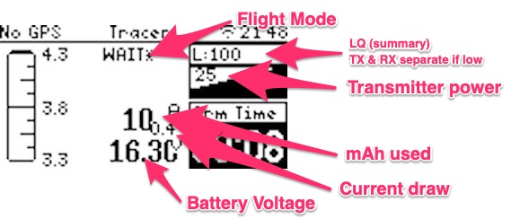

# FreedomTx Lua Dashboard (for TBS Crossfire & TBS Tracer)

a simple Dashboard i made for my own use for the TBS Mambo Radio
- Supports TBS Crossfire & TBS Tracer
- also works on other OpenTX / Edge TX Radios from other manufacturers

Features (Current)
- show essential informations like
- Battery Voltage, Current Draw, Capacity used, Timer1, Flight Mode, LQ as number and Bar, TX Power
- if GPS FIX also shows SPeed/TopSpeed,sat count and Altitude

- Audio info abattery level (5% steps, every 10 sec for first 3mAh used)
- makes audio sound (cricket) when LQ starts to fluctuate (early warning for Failsafe)
- dashboard showing GPS data (Speed, Altitude once fix)
- records TopSpeed (will be displayed on disarm or when fix lost)

- auto-reset values on battery change (when Current draw resets, no need to restart ever)

let me know if you want me to add somethings
Credit: Recycled some code from Andrew Farley

Idle screen (No GPS)

In Flight (with GPS data)

ToDo:
- replace battery graphic for Orientation (if GPS)
- replace battery graphic for Statistics(if No GPS)
- use global values (not re-fetching values)
- better number format
- get rid of multiple default definitions
- not show anything if values are zero
- auto center Flight mode (FM)
- mini battery and Battery Icon Broken

Changelog:
- store max amp used
- add Flight mode Placeholder
- reset values on >0 and <3mA
- remember last Cpacity value
- hide all GPS information if no GPS connected
- auto reset key values with new battery [checkForNewBattery()]
- showtopspeed
- show power usage
- add GPS data (altitude, sat count, speed)
- add mAh used (current Draw as small number)
- use LQ instead of RSSI
- auto align lables (like Volts and amps)
- Removed the Quad animation (just a waste of space)
